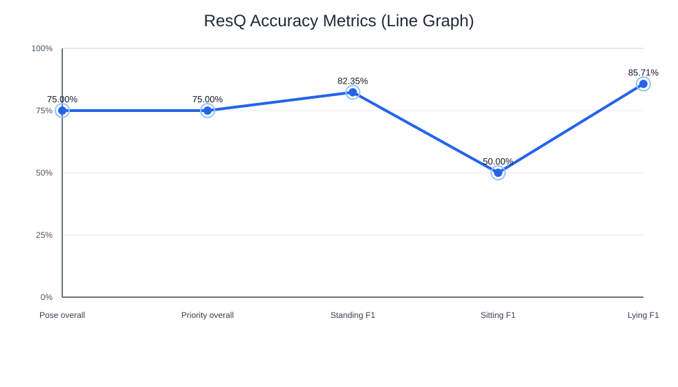

# Accuracy Metrics Report

Generated: 2026-03-29 22:10:34

Source: full_report.json

## Dataset Summary

- Test images: 7
- Ground-truth entries: 16
- Matched detections: 16
- Undetected false negatives: 0
- IoU threshold: 0.5

## Overall Metrics

| Task | Overall Accuracy | Macro Precision | Macro Recall | Macro F1 | Weighted Precision | Weighted Recall | Weighted F1 |
|---|---:|---:|---:|---:|---:|---:|---:|
| Pose | 75.00% | 0.7889 | 0.7167 | 0.7269 | 0.7646 | 0.7500 | 0.7308 |
| Priority | 75.00% | 0.7889 | 0.7167 | 0.7269 | 0.7646 | 0.7500 | 0.7308 |

## Pose Per-Class Metrics

| Class | Precision | Recall | F1 | Support | TP | FP | FN |
|---|---:|---:|---:|---:|---:|---:|---:|
| standing | 0.7000 | 1.0000 | 0.8235 | 7 | 7 | 3 | 0 |
| sitting | 0.6667 | 0.4000 | 0.5000 | 5 | 2 | 1 | 3 |
| lying | 1.0000 | 0.7500 | 0.8571 | 4 | 3 | 0 | 1 |

## Priority Per-Class Metrics

| Class | Precision | Recall | F1 | Support | TP | FP | FN |
|---|---:|---:|---:|---:|---:|---:|---:|
| LOW | 0.7000 | 1.0000 | 0.8235 | 7 | 7 | 3 | 0 |
| MEDIUM | 0.6667 | 0.4000 | 0.5000 | 5 | 2 | 1 | 3 |
| HIGH | 1.0000 | 0.7500 | 0.8571 | 4 | 3 | 0 | 1 |

## Graph

